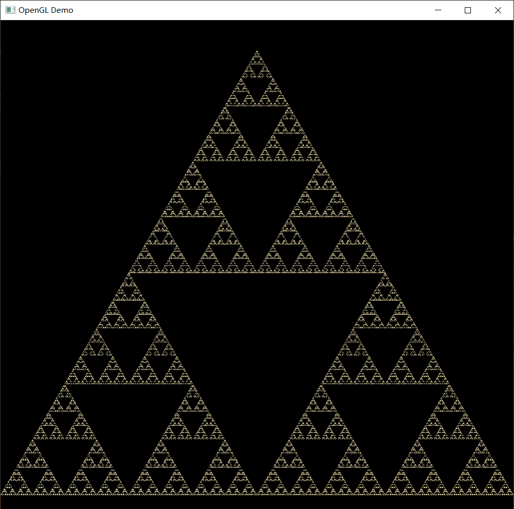
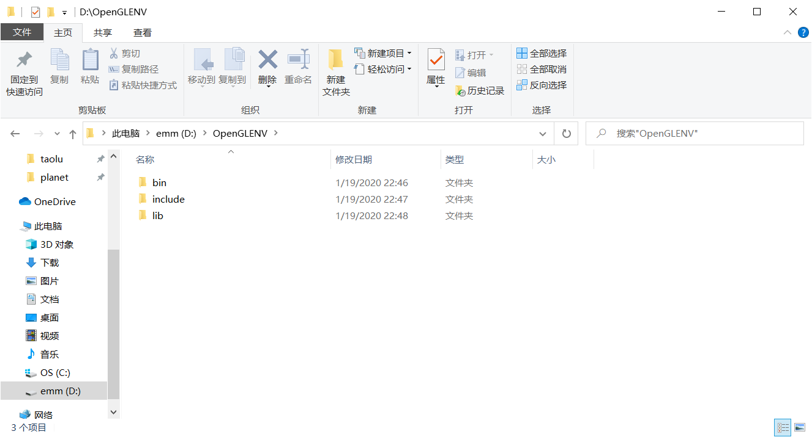
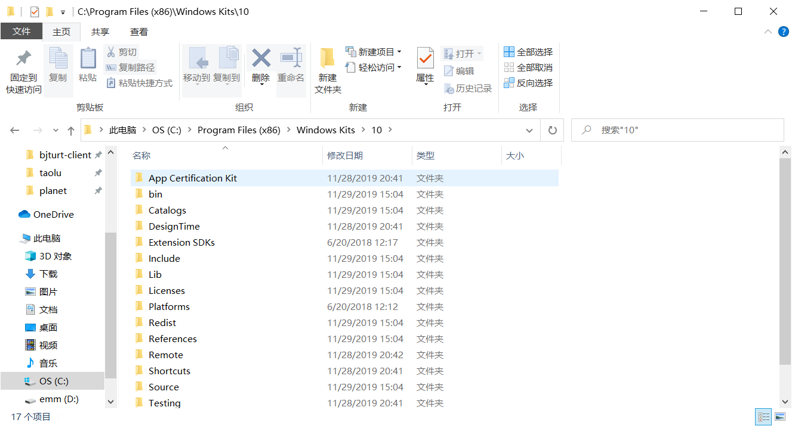
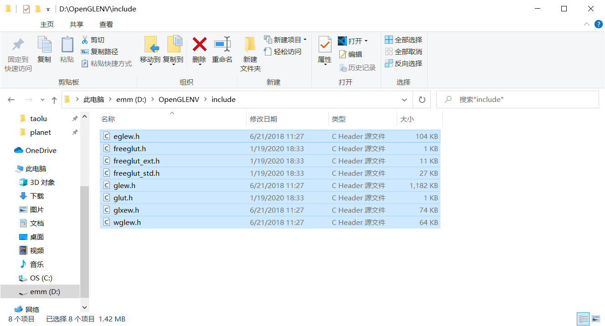
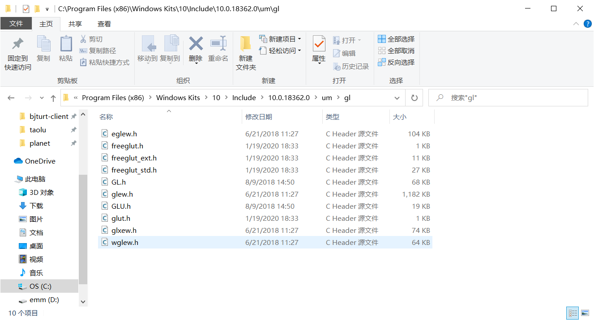
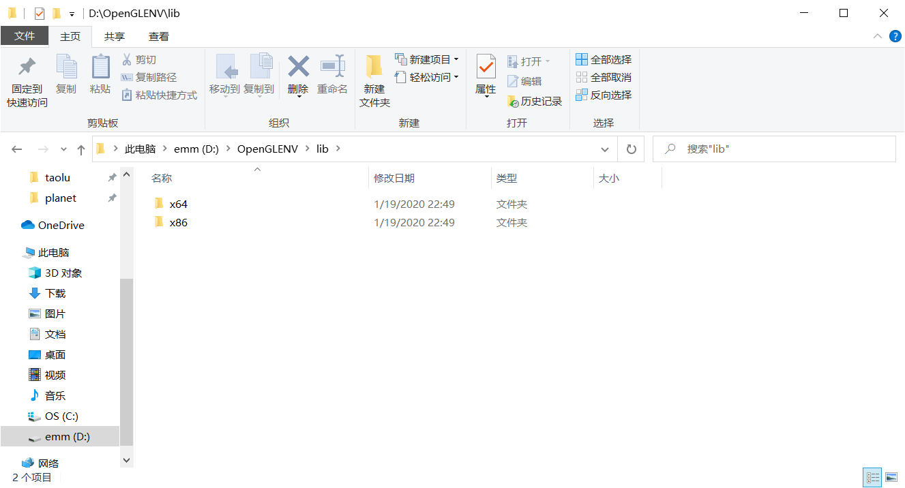
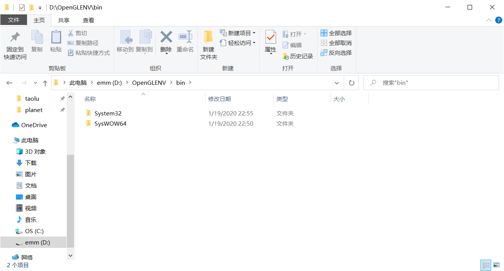

# 计算机图形学&OpenGL系列教程（一） OpenGL环境的配置

## 前言

&emsp; &emsp;本教程为北京交通大学2020年春季学期计算机与信息技术学院开设的计算机图形学课程准备，使用<a href="https://wiki.hk.wjbk.site/wiki/OpenGL">OpenGL</a>作为图形渲染引擎，并使用<a href="https://wiki.hk.wjbk.site/wiki/Freeglut">freeglut</a>创建窗口，处理键盘，鼠标输入等。内容涵盖从OpenGL环境的配置一直到创建简单的带有光源的三维场景。计算机图形学这门课程相比于之前所学的专业课如web基础训练，计算思维导论等，入门门槛较高，需要一些高等数学中空间解析几何，线性代数的知识；对于没有图形编程或者图像处理基础的同学来说，需要理解和掌握的新的概念也很多；程序代码量较大，需要一定编码能力；加之同学们从学长学姐那边听到的各种妖魔化这门课程的言论；因此我这里出了一个针对这门课程的教程，本配有相关代码及Visual studio工程；同时也算是作为学院科协信息部部长的工作。同时也因为只是针对课程的教程，也会有很多相关计算机图形学的内容的缺失，有兴趣的同学可以自行学习更多内容。

如转载本教程请保留出处。

## 什么是计算机图形学

&emsp; &emsp;简单地说，计算机图形学的主要研究内容就是研究如何在计算机中表示图形、以及利用计算机进行图形的计算、处理和显示的相关原理与算法。图形通常由点、线、面、体等几何元素和灰度、色彩、线型、线宽等非几何属性组成。从处理技术上来看，图形主要分为两类，一类是基于线条信息表示的，如工程图、等高线地图、曲面的线框图等，另一类是明暗图，也就是通常所说的真实感图形。

&emsp; &emsp;计算机图形学一个主要的目的就是要利用计算机产生令人赏心悦目的真实感图形。为此，必须创建图形所描述的场景的几何表示，再用某种光照模型，计算在假想的光源、纹理、材质属性下的光照明效果。所以计算机图形学与另一门学科计算机辅助几何设计有着密切的关系。事实上，图形学也把可以表示几何场景的曲线曲面造型技术和实体造型技术作为其主要的研究内容。同时，真实感图形计算的结果是以数字图象的方式提供的，计算机图形学也就和图像处理有着密切的关系。

&emsp; &emsp;图形与图像两个概念间的区别越来越模糊，但还是有区别的：图像纯指计算机内以位图形式存在的灰度信息，而图形含有几何属性，或者说更强调场景的几何表示，是由场景的几何模型和景物的物理属性共同组成的。

&emsp; &emsp;计算机图形学的研究内容非常广泛，如图形硬件、图形标准、图形交互技术、光栅图形生成算法、曲线曲面造型、实体造型、真实感图形计算与显示算法、非真实感绘制，以及计算可视化、计算机动画、自然景物仿真、虚拟现实等。

（来自wikipedia，更多信息可见<a href="https://wiki.hk.wjbk.site/wiki/%E8%AE%A1%E7%AE%97%E6%9C%BA%E5%9B%BE%E5%BD%A2%E5%AD%A6">这里</a>）

## 什么是OpenGL


&emsp; &emsp;OpenGL（全称：Open Graphics Library，译名：开放图形库或者“开放式图形库”）是用于渲染2D、3D矢量图形的跨语言、跨平台的应用程序编程接口（API）。这个接口由近350个不同的函数调用组成，用来从简单的图形比特绘制复杂的三维景象，常用于CAD、虚拟现实、科学可视化程序和电子游戏开发。

&emsp; &emsp;OpenGL规范由1992年成立的OpenGL架构评审委员会（ARB）维护。ARB由一些对创建一个统一的、普遍可用的API特别感兴趣的公司组成。根据OpenGL官方网站，2002年6月的ARB投票成员包括3Dlabs、Apple Computer、ATI Technologies、Dell Computer、Evans & Sutherland、Hewlett-Packard、IBM、Intel、Matrox、NVIDIA、SGI和Sun Microsystems，Microsoft曾是创立成员之一，但已于2003年3月退出。

（以上来自wikipedia，更多信息可见<a href="https://wiki.hk.wjbk.site/wiki/OpenGL">这里</a>）

&emsp; &emsp;本次教程将使用OpenGL4.0，主要在Windows平台上使用Visual studio，配之以freeglut, glew两个第三方库（没有使用glm数学库，因为相关数学方面的东西属于是考试内容，因此教程中将自行实现所需的数学函数），利用可编程渲染管线实现一个分形三角形的绘制，效果如图：



## 在Visual Studio中使用OpenGL

&emsp; &emsp;据说计算机图形学课程最让人头疼的问题就是配置一个可以编译和运行OpenGL应用程序的环境。<del> 相传有同学从课程开始到结束都没能配出环境，如果找助教帮忙他们会先让你装个VS2013再说 </del>。依照前面说的，本教程使用freeglut和glew两个第三方库。freeglut是一个用来创建支持OpenGL渲染的窗口，以及能够处理键盘鼠标等输入的库，并且使用起来相当简单(相比于直接使用Windows API创建OpenGL设备上下文(Device Context)和渲染上下文(Render Context)，或是其它类似的库例如glfw)。glew是一个让你能够使用现代OpenGL特性的库(由于微软公司有自家的产品Direct3D与OpenGL是竞争对手关系，Windows系统自带的OpenGL API只支持到OpenGL1.1，为了能使用更新的OpenGL需要glew)。

&emsp; &emsp;freeglut和glew的文件我已经打包整合到一起，可以前往<a href="https://pan.baidu.com/s/1cwnPLTeflOh_lo85ILwJUQ">百度网盘</a>下载，提取码: ed1h。下面把它们安装到你的Visual studio里面（这个方法适用于VS2015,2017,2019及以上）:

<li> 解压网盘下载的OpenGLENV.zip，进入后看到这三个文件夹：</li>



<li> 找到Windows Development Kits的安装路径，一般是在 C:\Program Files (x86)\Windows Kits下</li>

如果你电脑是Windows 10系统，那么会在里面看到一个叫“10”的文件夹，进入：




<li> 接下来将OpenGLENV文件夹下子文件夹include文件夹内的所有头文件选中，复制




<li> 然后粘贴到C:\Program Files (x86)\Windows Kits\10\Include\10.0.18362.0\um\gl 这个文件夹里面（注意这个路径，Include文件夹下面的文件夹的数字表示Windows10 SDK的版本，你的可能不是18362而是别的，也是可以的，如果有多个，应当选择版本号最大的一个，但保险起见你可以对每个都进行下面这些操作）



这样就完成了头文件的安装

<li> 接下来安装库文件

进入OpenGLENV下的lib文件夹，里面有两个子文件夹，x86和x64，分别对应32位版本和64位版本的库文件



将x86文件夹内的两个.lib文件选中，复制粘贴到C:\Program Files (x86)\Windows Kits\10\Lib\10.0.18362.0\um\x86里面，将x64文件夹内的两个.lib文件选中，复制粘贴到C:\Program Files (x86)\Windows Kits\10\Lib\10.0.18362.0\um\x64里面（注意路径，和之前说的一样，你的版本号可能跟我的不一样，有多个版本的话可以多个版本里都安装），就完成了库文件的安装


<li> 运行库的安装



进入OpenGLEnv下的bin文件夹，里面有两个子文件夹，System32和SysWOW64，分布对应64位和32位的运行时动态链接库(没错，没写反）。将System32子文件夹下的两个.dll文件复制粘贴到C:\Windows\System32里面，将SysWOW64子文件里面的两个.dll文件复制粘贴到C:\Windows\SysWOW64文件夹里面即可。这样就完成了运行库的安装。

至此OpenGL开发环境安装完成，可以试验一下，创建一些新的C++项目，加入下面的代码（或者直接下载教程的<a href="./FirstOpenGL">FirstOpenGL工程</a>）

目前阶段不必理解代码的含义，这只是为了测试你刚才的OpenGL环境是否成功安装，代码有意地使用了现代OpenGL的特性去实现，如果代码能够顺利编译运行看到金色分形三角形，那么恭喜你，可以正式开始计算机图形学和OpenGL的学习了。本教程会尽量一直使用这样单个文件的源代码形式，<del>便于交作业</del>


```C++
#include <Windows.h>   //这个头文件要在opengl的头文件之前
#include <gl/glew.h>   //这个头文件要在其它opengl的头文件之前
#include <gl/glut.h>
#include <utility>
#include <string>
#include <vector>
#include <iostream>
#include <algorithm>
#include <ctime>
#include <cstdlib>

#define makeString(x) #x
#pragma comment(lib, "opengl32.lib")
#pragma comment(lib, "freeglut.lib")
#ifdef _WIN64   //如果编译64位程序
#pragma comment(lib, "glew64.lib")
#else 
#pragma comment(lib, "glew32.lib")
#endif
//画面的宽度和高度（像素）
constexpr int viewWidth = 800;
constexpr int viewHeight = 800; 

class GLProgram
{
    union {
        struct {
            GLuint vshader, fshader;
        }shaders;
        GLuint shadersByIndex[sizeof(shaders) / sizeof(GLuint)];
    };
    constexpr static int shadersGLTable[] = {GL_VERTEX_SHADER, GL_FRAGMENT_SHADER};
    
    GLuint program;

    void createShader(const std::string& code, int index) {
        const GLchar* codea[1] = { code.c_str() };
        GLuint& shader = shadersByIndex[index];

        shader = glCreateShader(shadersGLTable[index]);
        if (!shader)
            throw std::runtime_error("Can not create shader(glCreateShader)");
        glShaderSource(shader, 1, codea, nullptr);
        glCompileShader(shader);
        GLint res;
        glGetShaderiv(shader, GL_COMPILE_STATUS, &res);
        if (res == GL_FALSE) {
            GLint len;
            glGetShaderiv(shader, GL_INFO_LOG_LENGTH, &len);
            if (len > 0) {
                std::string info;
                info.resize(len + 1);
                int w;
                glGetShaderInfoLog(shader, len, &w, (GLchar*)(info.c_str()));
                info[w] = 0;
                throw std::runtime_error("Shader compilation error:" + info);
            }
        }
    }

public:
    constexpr static int INDEX_VERTEX_SHADER = 0;
    constexpr static int INDEX_FRAGMENT_SHADER = 1;

    GLProgram() {
        memset(&shaders, 0, sizeof(shaders));
        program = 0;
    }
    ~GLProgram() {
        if (shaders.vshader)
            glDeleteShader(shaders.vshader);
        if (shaders.fshader)
            glDeleteShader(shaders.fshader);
        if (program)
            glDeleteProgram(program);
    }

    void createVShader(const std::string& code) {
        createShader(code, INDEX_VERTEX_SHADER);
    }
    void createFShader(const std::string& code) {
        createShader(code, INDEX_FRAGMENT_SHADER);
    }
    void createProgram() {
        program = glCreateProgram();
        if (!program)
            throw std::runtime_error("Fail to create opengl program(glCreateProgram)");
        glAttachShader(program, shaders.vshader);
        glAttachShader(program, shaders.fshader);
        glLinkProgram(program);
        GLint res;
        glGetProgramiv(program, GL_LINK_STATUS, &res);
        if (res == GL_FALSE) {
            GLint len;
            glGetProgramiv(shaders.fshader, GL_INFO_LOG_LENGTH, &len);
            if (len > 0) {
                std::string info;
                info.resize(len + 1);
                int w;
                glGetProgramInfoLog(shaders.fshader, len, &w, (GLchar*)(info.c_str()));
                info[w] = 0;
                throw std::runtime_error("Fail to link opengl program:" + info);
            }
        }
    }
    void useProgram() const {
        if (!program) {
            throw std::runtime_error("Trying to use an invalid opengl program");
        }
        glUseProgram(program);
    }
    GLuint getProgram() const { return program; }
    operator GLuint() const {  //对象被强制转换为GLuint时调用的函数
        return program;
    }
    operator int() const { return program; }
};

//初始化OpenGL
void initGL() {
    GLenum err = glewInit();
    if (err != GLEW_OK) {
        MessageBox(0, TEXT("初始化GLEW失败"), TEXT("错误"), 0);
        exit(1);
    }
    if (!GLEW_VERSION_4_0) {  //检查OpenGL4.0支持
        MessageBox(0, TEXT("本计算机未支持OpenGL4.0"), TEXT("错误"), 0);
        exit(1);
    }
    glEnable(GL_FRAMEBUFFER_SRGB); //开启伽马校正
}

struct Point {
    float x, y;
    Point middle(const Point& p) const {  //与另一个点的中点
        return Point{ (x + p.x) / 2, (y + p.y) / 2 };
    }
};
struct Triangle {
    Point points[3];
};
struct Color {
    float r, g, b, a;
};


//下面是顶点着色器和片段着色器的代码，功能非常基础，只是为了测试着色器功能是否正常
static const char* vertexShaderCode = makeString(
#version 400\n
layout(location = 0) in vec2 pos;
out vec4 vo_pos;
void main() {
    gl_Position = vec4(pos.x, pos.y, 0.0, 1.0);
}
);

static const char* fragmentShaderCode = makeString(
#version 400\n
uniform vec4 color;
void main() {
    gl_FragColor = color;
}
);

class RenderState {
    unsigned long long tick;   //计时数
    //TODO: 将绘制需要的资源定义在这里
    GLProgram program;
    constexpr static int MAX_DEPTH = 9;
    GLuint VAO, VBO;

    //每一帧逻辑数据更新的工作
    void update() {
        tick++;
    }
public:
    RenderState() {
        tick = 0;
    }
  
    //在第一次绘制之前的工作
    void preScene() {
        printf("PreScene");
        program.createVShader(vertexShaderCode);
        program.createFShader(fragmentShaderCode);
        program.createProgram();
        program.useProgram();

        //这里创建一个VAO和VBO可以储存一个三角形的三个顶点
        glGenVertexArrays(1, &VAO);
        glGenBuffers(1, &VBO);
        glBindVertexArray(VAO);
        glBindBuffer(GL_ARRAY_BUFFER, VBO);
        glVertexAttribPointer(0, 2, GL_FLOAT, true, 2 * sizeof(float), nullptr);
        glEnableVertexAttribArray(0);
        //实际上绘制完后应该调用glDeleteBuffer等销毁资源...然而glut窗口关闭时是直接退出的，没有机会销毁资源...
        //就先这样了
    }
 
    void recursiveDraw(const Triangle& tr, int depth = 0) {
        if (depth == MAX_DEPTH) 
            return;

        //更新顶点缓冲的数据:将顶点数据换成当前三角形的三个顶点
        glBufferData(GL_ARRAY_BUFFER, sizeof(tr), &tr, GL_DYNAMIC_DRAW);
       
        glUniform4f(glGetUniformLocation(program, "color"), 0.88, 0.76, 0.42, 1.0);  //金色
        glDrawArrays(GL_TRIANGLES, 0, 3);  
  
        //将中间掏空
        Point m1 = tr.points[0].middle(tr.points[1]);
        Point m2 = tr.points[0].middle(tr.points[2]);
        Point m3 = tr.points[1].middle(tr.points[2]);
        Triangle m = { m1, m3, m2 };  //由三边中点构成的三角形
        glBufferData(GL_ARRAY_BUFFER, sizeof(m), &m, GL_DYNAMIC_DRAW);
        glUniform4f(glGetUniformLocation(program, "color"), 0.0, 0.0, 0.0, 0.0);
        glDrawArrays(GL_TRIANGLES, 0, 3);

        //绘制下一层：
        recursiveDraw(Triangle{ tr.points[0], m1, m2 }, depth + 1);
        recursiveDraw(Triangle{ m1, tr.points[1], m3 }, depth + 1);
        recursiveDraw(Triangle{ m2, m3, tr.points[2] }, depth + 1);
    }
    //每一帧绘制的工作
    void render() {
        update(); //先更新逻辑，后面进行渲染
        glClear(GL_COLOR_BUFFER_BIT | GL_DEPTH_BUFFER_BIT);
        glClearColor(0.0f, 0.0f, 0.0f, 0.0f);  //设置透明色为背景色

        recursiveDraw(Triangle{ Point{0.0, 0.882}, Point{-1.0, -0.85}, Point{1.0, -0.85} });

        glutSwapBuffers();
        glutPostRedisplay();
    }

}state;

void render() {
    state.render();
}

int main(int argc, char* argv[]) {
    srand(time(NULL));
    glutInit(&argc, argv);
    glutInitDisplayMode(GLUT_RGBA | GLUT_DOUBLE);   //RGBA颜色模式，双缓冲
    glutInitWindowSize(viewWidth, viewHeight);    //窗口的宽和高
    glutCreateWindow("OpenGL Demo");
    //下面两行代码注意一定放在glutCreateWindow的后面才行，否则会因为没有创建opengl上下文而失败。
    glViewport(0, 0, viewWidth, viewHeight);
    initGL();  
    state.preScene();
    glutDisplayFunc(render);
    
    glutMainLoop();
    return 0;
}
```

## 自测题目&启示

<li > 简述计算机图形学是什么 </li>

<li > 在上一节中安装freeglut和glew的方法，也适用于安装其它任何的库，尽量掌握 </li>