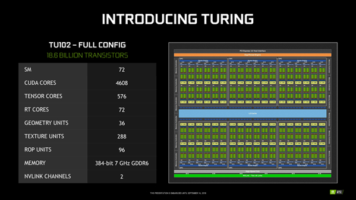
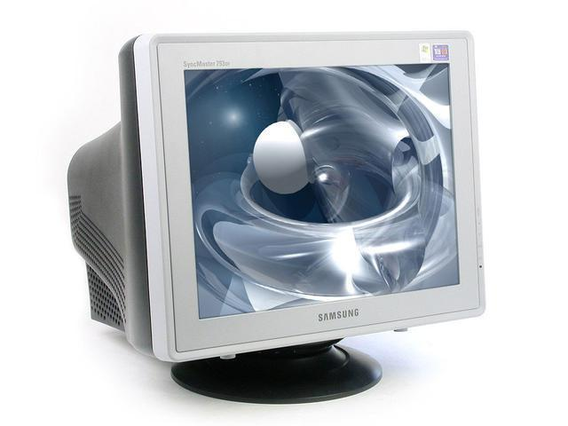

# 计算机图形学&OpenGL系列教程（二） 图像、显卡与显示器

转载请保留出处

## 为什么有这个内容？

&emsp;&emsp;在上一章中提到，计算机图形学主要研究内容就是研究如何在计算机中表示图形、以及利用计算机进行图形的计算、处理和显示的相关原理与算法。网上大多数教程都缺失对图像，以及渲染图像的显卡，显示图像的显示器的介绍，然而这些内容又是必要的，只有了解一定的这些内容的原理，才能正确使用OpenGL进行计算机图形学的学习。此外，本章的内容也对于学习数字图像处理，计算机视觉，或者理解现在显卡用于人工神经网络的训练的原理有一定的帮助。

## 图像

### 计算机中表示图像数据的方法

&emsp;&emsp;首先，由于计算机显示器是发光的光源，因此显示的任何颜色都是通过红色(R)，绿色(G)，蓝色(B)所谓的光学三原色合成所得。图形学中也常常使用三原色的信息去表示图像，一个颜色可以用向量(R, G, B)表示。每个分量的范围，如果用整数表示的话常见范围是\[0, 255\](只取整数)，如果用实数表示，则常见范围为\[0, 1\](包含0到1之间所有实数)。一个分量的值越大，则其对应的颜色越“浓”。如果使用整数表示颜色的分量，那么纯红色就是(255, 0, 0)，纯绿色是(0, 255, 0)，纯蓝色是(0, 0, 255)，纯紫色是纯红色与纯蓝色的混合，是(255, 0, 255)。此外，还可以给颜色加入第四个分量，不透明度A(Alpha)，通常用在多张图像的混合中，直观地看，不透明度越大，则在与其它图像叠加合成时，越无法看到在这张图片的下面的图像。(有使用过Photoshop的同学都懂的~)


&emsp;&emsp;计算机中图像都是一个矩形，具有宽度和高度，宽度表示图像在水平方向上的像素数量，高度表示图像在竖直方向上的像素数量。通常我们依照像素在图像内的位置，类似笛卡尔坐标系那样，取图像左上角为原点(0,0)，水平向右方向为x轴正方向，竖直向下方向为y轴正方向，这样给图像的每一个像素编码一个位置坐标(x, y)。以后我们就使用这个位置坐标(x,y)代指位于(x,y)位置的像素点。

 

&emsp;&emsp;每一个像素点上通常储存这一个像素的颜色信息，颜色信息数据的大小(比特数)称作**位深度**，例如图像每一个像素使用3个float储存颜色信息，那么图像的 最终图像的有像素构成了图像。

&emsp;&emsp;这里列出实际编程中常见的两种颜色信息的编码方法：

#### 索引图像

&emsp;&emsp;在索引图像内部，包含一个额外的颜色映射表(color map，简称颜色表)，颜色表内包含了图像中所有用到的颜色color[0], color[1], color[2], ..., 颜色表内所有颜色都由是一个颜色向量(R, G, B)。

&emsp;&emsp;有了颜色表，图像的每一个像素点只储存它表示的颜色在颜色表中的位置(下标)即可。

例如有一张宽度为4，高度为3的索引图像，颜色表为：

```C
color[0] = (255, 0, 0)
color[1] = (0, 0, 255)
```
图像的所有像素为：
```C
1111
0000
1111
```
查颜色表可得，0表示(0,0,255), 1表示(255,0,0)，那么这就看作是一张背景为蓝色，中间一条红线的图像。

#### RGB图像

另一种现在更常用于表示真彩色图片的图像编码方法，则是直接在每一个像素上储存颜色本身，也就是每一个像素直接储存一个(R,G,B)（或者是(R,G,B,A))，表示图像。例如索引图像中的例子，用RGB图像表示就是：

```
(0,0,255)(0,0,255)(0,0,255)(0,0,255)
(255,0,0)(255,0,0)(255,0,0)(255,0,0)
(0,0,255)(0,0,255)(0,0,255)(0,0,255)
```

### 图像数据的储存

&emsp;&emsp;在依上一节的方法，将图像编码成图像数据后，在OpenGL中往往是直接可以使用的。然而我们平常所见的图片文件的情况要更复杂一些。常见的典型的图片文件，有BMP，PNG, JPEG(JPG)三种文件格式，相对应三种图片文件编码方式，BMP是一种无压缩的图片文件格式，将图片信息放在文件头部，后面直接存放原始的颜色表(如果有)和像素数据。PNG是一种无损压缩的图片格式，直接储存图片的像素数据通常比较占用空间，PNG对数据进行了无损压缩。而JPEG是一种有损压缩的图片格式，通常能够得到比PNG格式更小的图片文件，但也会轻微损失图片质量。更加详细的信息参阅<a href="https://baike.baidu.com/item/%E5%9B%BE%E5%83%8F%E6%A0%BC%E5%BC%8F/277878?fr=aladdin">百度百科</a>，在我们学习OpenGL的过程中只需要学会使用第三方库读取图片文件得到图像数据，或者是把图像数据写入图片即可。

## 显卡

&emsp;&emsp;显卡(Video Card)在计算机中承担着向显示器输出视频信号的功能，早期的显卡只是一个能够将主机指定的要显示的数据，转化为显示器可以识别并显示出来的设备，还并没有具有独立处理图形的能力；随着技术的发展与需求的迭代，现代的显卡还具有图形处理，并行计算的能力，也能够实现AR,VR等技术， 目前PC端的独立显卡的主要显卡供应厂商为**NVIDIA**(英伟达)和**AMD**(超威半导体公司)，只要采用NVIDIA显示芯片的显卡被称为N卡，采用AMD显示芯片的显卡被称为A卡。本教程无意争论N卡好还是A卡好，要避免意识形态之争，实事求是，与时俱进，凡是有利于学习OpenGL理解计算机图形学的显卡都是好显卡。此外，笔记本电脑往往为了节约功耗，会配备带有集成显卡的处理。

&emsp;&emsp;本教程中提到的显卡指代的都是上文中提到的现代化的显卡，也是同学们电脑上所使用的显卡（如果真的没有，那买新电脑吧）。显卡内含显示芯片，或称图形处理器(Graphics Process Unit, GPU)，具有并行计算能力，并配有专用的显示储存器(简称“显存”)，GPU与显存的关系，就如同CPU与主存(俗称“内存”)的关系。

&emsp;&emsp;GPU的并行计算能力，极大加速了图形处理的速度。我们以NVIDIA20系显卡为例，感性地说明其并行计算能力：




&emsp;&emsp;从上面三张图提供的数据可以直观的看到，GPU具有大量的计算单元（图中的10系和20系旗舰级显卡都有上千个，往往远远超过其搭配的cpu的核心数），在实际使用时可以进行大规模地并行计算。而图形处理正是适合使用并行计算的场景，在之后的学习中我们会发现，我们会对所有输入的图元，以及图元栅格化后所得图像的所有像素，运行同样的一段代码(之后会讲到，在渲染流水线中，我们对输入的所有顶点运行同一个顶点着色器程序，对图像所有像素运行同一个片段着色器程序)，而且互不干扰。如果使用CPU去完成，由于CPU核心数量少，一次能够同时处理的图元或者像素数量少。而GPU有着大量的可并行计算的核心，能够同时为大量的图元或者像素运行程序，这也是GPU在图形处理速度上总远远优于CPU的主要原因。此外，GPU这种大规模并行计算的能力，也被发掘并应用到其它领域，例如机器学习，区块链等。但是GPU也有其自身的局限性，它的单核性能往往远比CPU单核要差，而且由于GPU的特殊构架设计，它只适合进行简单的数学计算，而不适合应对更加复杂的业务场景（比如说GPU上代码使用if条件分支语句会极大损耗性能）。我们可以这样形象地比喻CPU和GPU，CPU是一名博士生，而GPU是一大群小学生，对于大量的简单题目，一大群小学生完成的速度自然比一名博士生要快。然而对于困难的问题，博士生依然可以完成，而一大群小学生也无法完成。

&emsp;&emsp;CPU与与之搭配的主存，GPU有与之搭配的显存，主存和显存中都是可以储存数据的，他们之间也是可以进行数据的交换的。然而主存和显存之间数据传输的速度是远比CPU与主存或是GPU与显存之间的速度要慢的（一般来说要慢一个数量级），因此在实际编程中我们应当尽量避免不必要的主存和显存之间的数据交换。

&emsp;&emsp;拓展：早期依照IBM计算机的名为"VGA"的显示标准，在文本模式下内存绝对地址0xb8000处，或图形模式下内存绝对地址0xa0000处，存放要在显示器上显示的数据，显卡只会定期(时间间隔相当短)将这里的数据转换并传至显示器显示，而有关图形的计算，都需要CPU去进行，CPU计算好后再依照指定的数据格式写入规定的内存地址，当时的CPU的主频也不够高，显示器的分辨率也不高，使得无法呈现足够精致的画面。对比现代显卡的设计，我们能够切实认识到现代显卡这样的设计，确实是能够极大提高计算机图形能力的。

&emsp;&emsp;对于学习OpenGL和计算机图形学，有关显卡的内容初步了解这些已经可以了。更多内容可以查阅相关资料了解。

## 显示器

显示器(display)通常也被称为监视器(monitor)，是一种可以将特定的输入信号显示成像的设备。根据制造材料的不同，可分为：阴极射线管显示器（CRT），等离子显示器PDP，液晶显示器LCD等等。更多资料详见<a href="https://baike.baidu.com/item/%E6%98%BE%E7%A4%BA%E5%99%A8/362722?fr=aladdin">百度百科</a>

 


在OpenGL编程中我们一般关心显示的两个参数，分辨率和刷新率。

### 分辨率

&emsp;&emsp;显示器的分辨率是指水平和竖直方向上的像素点数，单位是px。对于实际物理尺寸相同的显示器，分辨率越高，能在屏幕上展示出的像素数就越多，同时单个像素点的尺寸会越小。我们常用水平方向上的像素是x竖直方向上的像素数的形式描述分辨率，例如俗称的1080P分辨率的常见规格为：1920x1080

这里列出显示器常见的分辨率：

<table>
<tr>
<th>
</th>
<th>
常见分辨率大小
</th>
</tr>
<th rowspan="2"> 360P </th> <th > 480x360</th> 
</tr>
<tr> <th> 600x360 </th> </tr>
<tr>
<th> 720P </th> <th> 1280x720</th>
</tr>
<tr>
<th> 1080P </th> <th> 1920x1080</th>
</tr>
<tr>
<th> 2k </th> <th> 2560x1440 </th>
</tr>
<tr>
<th rowspan="3"> 4k </th> <th> 4096x3112</th>
</tr>
<tr> <th> 3656x2664 </th> </tr>
<tr> <th> 3840x2160</th> </tr>
<tr>
<th> 8k </th> <th> 7680x4320</th>
</tr>
</table>

### 刷新率

&emsp;&emsp;屏幕刷新率是指每秒钟屏幕刷新重新显示内容的次数。这是一个概括的说法因为不同材质的显示器的具体做法往往不同。对于传统显示器来讲，刷新频率越低，图像闪烁和抖动的就越厉害，眼睛疲劳得就越快。有时会引起眼睛酸痛。典型的刷新率有60Hz, 120Hz, 144Hz。而电竞玩家一般追求更高的刷新率，例如240Hz，高刷新率的屏幕高屏幕刷新率对于电竞游戏的影响主要包含增加画面流畅度、避免画面撕裂、削弱因液晶屏幕拖影而产生的眩晕感。对于相同的分辨率，刷新率越高，那么就要求显示器的延迟越低，同时要求显卡到显示器的传输带宽(每秒钟传输的数据的比特数，常用单位Gbps，G比特每秒)越高。在图形学编程中我们经常会令渲染到屏幕上的图形的更新，与显示器的刷新保持同步，这就是所谓的“垂直同步”。随着技术的发展，近年来又出现了支持Free-Sync或者G-Sync的显示器，他们可以动态调整显示器的刷新频率与显卡输出图形的频率保持一致。

### 显示器的伽马校正

作为课外了解内容，参考<a href="https://learnopengl-cn.github.io/05%20Advanced%20Lighting/02%20Gamma%20Correction/">这里</a>

## 自测题目&启示

<li> 分别用索引图像和RGB图像两种形式，表示一张宽为7像素，高为7像素，以纯蓝色为背景色，图像中心一个宽度为5，高度为5的纯绿色正方形的图像。类似如图：


<li> 简述BMP图片文件的特点与不足

<li> 简述JPEG(JPG)图片文件的特点与不足

<li> 简述PNG图片文件和JPEG(JPG)图片文件的主要区别

<li> 简述颜色的不透明度分量A(alpha)的作用

<li> 简述为什么现代GPU的大规模并行计算能力有助于加速图形计算

<li> 为什么说要尽量避免在主存和显存之间交换数据

<li> 如果你的电脑支持并设置为1080P(1920x1080)分辨率，刷新率为120Hz，24位真彩色模式，那么理论上对你的显卡到显示器的带宽的最低要求是多大？（题库中有类似题目）

<li> (开放题目)如果现在你要买一台新电脑，结合你自己的需求(是学习办公多，还是游戏多，玩什么类型的游戏?)和经济状况，你会买哪一家什么型号的显卡?

<li> (开放题目)还是上一题的背景，你会买一台怎样的显示器？

<li> (开放题目)N卡好还是A卡好？(滑稽护体)

