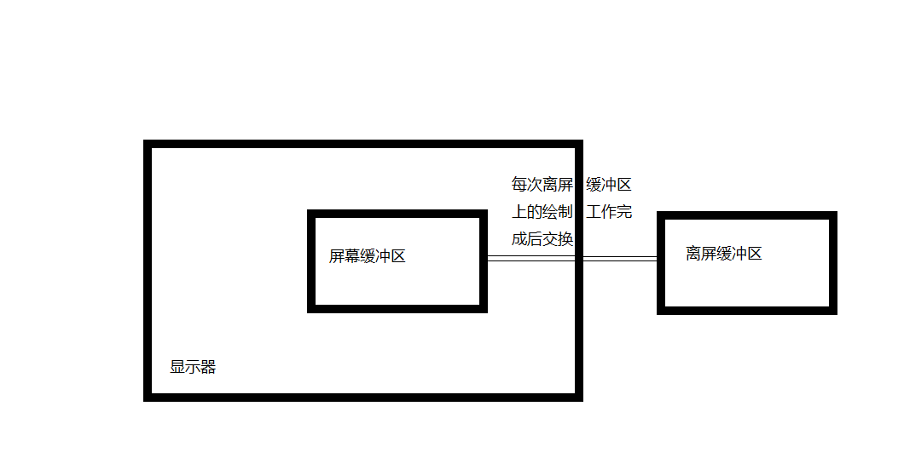
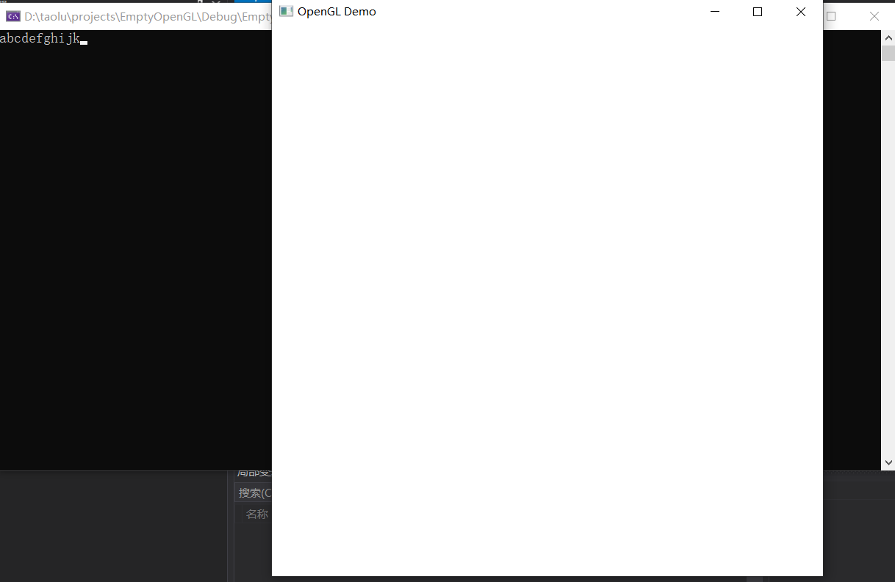

# 计算机图形学&OpenGL系列教程（三） 基本的程序框架
## 概述

&emsp;&emsp;本次教程将本着够用原则，将对代码进行比较精细的讲解，利用glut与glew创建一个基本的能够运行的OpenGL程序框架，同时讲解一些相关概念。

## glut

在第一次教程已经对glut做了简介，这里结合代码使用glut创建一个支持OpenGL渲染的窗口，并加入对键盘按键的处理函数，首先是头文件和库文件的引入：

```C++
#include <windows.h>   //这个头文件应当在opengl相关的头文件之前
#include <gl/glew.h>   //这个头文件应当在其它opengl相关的头文件之前
#include <gl/glut.h>
#include <iostream>    //输入输出
#pragma comment(lib, "opengl32.lib")
#pragma comment(lib, "freeglut.lib")
#ifdef _WIN64   //如果编译64位程序
#pragma comment(lib, "glew64.lib")
#else 
#pragma comment(lib, "glew32.lib")
#endif
```

&emsp;&emsp;这里解释一下代码，Windows.h是Windows应用程序开发所需的头文件，其中定义了很多与Windows开发有关的常量，会被OpenGL用到(如果你在非Windows平台上开发则不需要Windows.h)，因此应当在所有有关OpenGL的头文件之前包含；虽然下一小节才讲glew，但是glew.h要求在其它OpenGL头文件之前被包含，因此这里仍先写出。然后是glut.h，这是本节要讲的重点。接下来的#pragma comment(lib, ...)则是对库文件使用的声明，告诉链接器去链接后面所给出的库文件中的二进制代码(函数实现)，(有关头文件库文件等实际工程方面的内容本教程不多做介绍，如感觉理解困难请参阅《程序员的自我修养——编译、链接与库》一书)，如果不对此作出声明，那么链接器将会给出无法解析外部符号的错误导致无法生成最终的可执行文件。_WIN64是一个当你要编译生成64位应用程序的时候会被定义的宏，使用这个宏判断生成的目标平台也是一个常用技巧。

&emsp;&emsp;接下来写出main函数：
```C++
const int viewWidth = 600;
const int viewHeight = 600;

int main(int argc, char* argv[]) {
    glutInit(&argc, argv);
    glutInitDisplayMode(GLUT_RGBA | GLUT_DOUBLE);
    glutInitWindowSize(viewWidth, viewHeight);
    glutCreateWindow("OpenGL Demo");
    glViewport(0, 0, viewWidth, viewHeight);
    glutDisplayFunc(render);
    glutKeyboardFunc(keyEvent);
    glutSpecialFunc(specialKeyEvent);
    glutMainLoop();
    return 0;
}
```

&emsp;&emsp;glutInit为glut库进行初始化。

&emsp;&emsp;接下来glutInitDisplayMode(GLUT_RGBA | GLUT_DOUBLE) 指定了屏幕上绘制的图像的像素格式为(R,G,B,A)，使用**双缓冲**机制。

&emsp;&emsp;这里简单解释一下双缓冲机制：首先说一下缓冲区(Buffer)，缓冲区是一个很广泛的概念在之前的C/C++语言的学习中也有，OpenGL中如果不特别说明，缓冲区是指暂时置放输出或输入资料的主存或显存，它可以储存顶点或者图像等的数据。双缓冲机制使用两个缓冲区储存两个图像的数据，其中一个缓冲区储存在窗口中显示的图像，被成为屏幕缓冲区(Onscreen Buffer)，因为它表示的图像被展示在屏幕上，是可见的。另一个缓冲区表示的图像不再屏幕上，不可见，被成为后台缓冲区或者离屏缓冲区(Offscreen Buffer)。



&emsp;&emsp;我们把绘制图像的一系列操作在离屏缓冲区上完成，每次绘制完成后将屏幕缓冲区与离屏缓冲区交换，使得离屏缓冲区变为屏幕缓冲区，而之前的屏幕缓冲区变为离屏缓冲区，从而使得刚完成的绘制能够被呈现到屏幕上，同时避免了直接在屏幕缓冲区上绘制易造成画面异常(例如闪烁)等问题。

&emsp;&emsp;接下来glutInitWindowSize设定窗口内可用与绘制的区域的宽和高(以像素为单位)，再使用glutCreateWindow创建可用于OpenGL渲染的窗口，标题为OpenGL Demo。值得注意的是，只有在这里glutCreateWindow之后，OpenGL才是可用的，在glutCreateWindow之前，因为没有创建OpenGL渲染上下文，所有有关OpenGL的函数调用都是**无效**的。紧接着glutCreateWindow之后是glViewport，告诉OpenGL绘制的区域左上角坐标为(0, 0)，并提供宽度和高度(这里的坐标系和第二章的图像的坐标系是一致的)。 

&emsp;&emsp;接下来向glut注册渲染和处理键盘输入的函数，也是之前给出的代码里缺失的三个函数，在main函数之前加入它们的代码:

```C++
void render() {
    glClearColor(1.0, 1.0, 1.0, 1.0);
    glClear(GL_COLOR_BUFFER_BIT);

    //这里进行渲染的工作

    glutSwapBuffers();
   //glutPostRedisplay();
}

void keyEvent(unsigned char key, int, int) {
    printf("%c", key);   //参数key直接给出了输入的字符
}
void specialKeyEvent(int keyCode, int, int) {
    switch (keyCode) {    //通过keyCode的值判断是哪个特殊键
    case GLUT_KEY_F1:    //F1
        exit(0);         //实现按下F1退出程序
        break;
    default:
        break;
    }
}
```

&emsp;&emsp; 于是main函数中依次调用glutDisplayFunc(render); glutKeyboardFunc(keyEvent); glutSpecialFunc(specialKeyEvent); 依次注册在窗口上绘制图像的函数、处理键盘一般键位输入的函数、处理键盘特殊键位输入的函数。特殊键位指的就是键盘上例如方向键，功能键等有特殊含义的键，可以输入GLUT_KEY_在visual studio编辑器给出的代码提示中查看可用的特殊键位。而其它的键位就是一般键位，例如字母，数字等。在你敲击键盘时，就会调用你注册的这两个函数。

&emsp;&emsp; render函数中，在渲染工作之前，做了清理工作。glClearColor函数将清理用的颜色设置为(1.0, 1.0, 1.0, 1.0)，也就是纯白色，接下来使用glClear函数，参数GL_COLOR_BUFFER_BIT表示用glClearColor设定的颜色清除颜色缓冲区(其实还有别的类型的缓冲区，现在先不管)。于是将窗口清理为了纯白色。注意因为使用双缓冲，所以实际上清理工作也是在离屏的缓冲区上进行的，因此在渲染完成后，使用glutSwapBuffers()交换屏幕缓冲区与离屏缓冲区。如果需要render函数不停被调用，可以在最后加上glutPostRedisplay()要求重绘，这对于动画的展示是至关重要的，否则render函数只会在glut认为窗口需要重新绘制的时候被调用。

&emsp;&emsp; 在main函数最后，调用glutMainLoop()即可使得程序正常运行。现在可以编译运行看到结果：



## glew 

&emsp;&emsp;glew是一个跨平台的可以帮助C/C++开发者初始化高版本OpenGL API的工具，本教程也正是借助它的力量能够顺利使用OpenGL4.0。它的使用也很简单，在main函数之前加入这段代码:

```C++
void initGL() {
    GLenum err = glewInit();  //初始化
    if (err != GLEW_OK) {
        MessageBox(0, TEXT("初始化GLEW失败"), TEXT("错误"), 0);
        exit(1);
    }
    if (!GLEW_VERSION_4_0) {  //检查OpenGL4.0支持
        MessageBox(0, TEXT("本计算机未支持OpenGL4.0"), TEXT("错误"), 0);
        exit(1);
    }
}
```

&emsp;&emsp; 在main函数内glutCreateWindow之后调用initGL函数即可，之后就可以使用现代OpenGL特性了。这段代码是固定的，也很好理解，便再作解释。之后的教程的代码也会原封不动地复制粘贴使用。

本次教程的完整代码见<a href="./Code">这里</a>

## 自测题目&启示

<li> 简述双缓冲机制的工作方式(题库原题) </li>

<li> 一位同学写了这么一段代码：

```C++
//略去头文件，库文件的引入以及initGL, render函数的定义
int main(int argc, char *argv[]) {
    glutInit(&argc, argv);
    glutInitDisplayMode(GLUT_RGBA | GLUT_DOUBLE);
    glutInitWindowSize(233, 233);
    initGL();
    glutCreateWindow("emmmmmmm");
    glViewport(0, 0, 233, 233);
    glutDisplayFunc(render);
    glutMainLoop();
    return 0;
}
```
成功编译，然而运行却一直提示初始化GLEW失败，请指出其问题。 </li>
