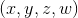
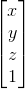
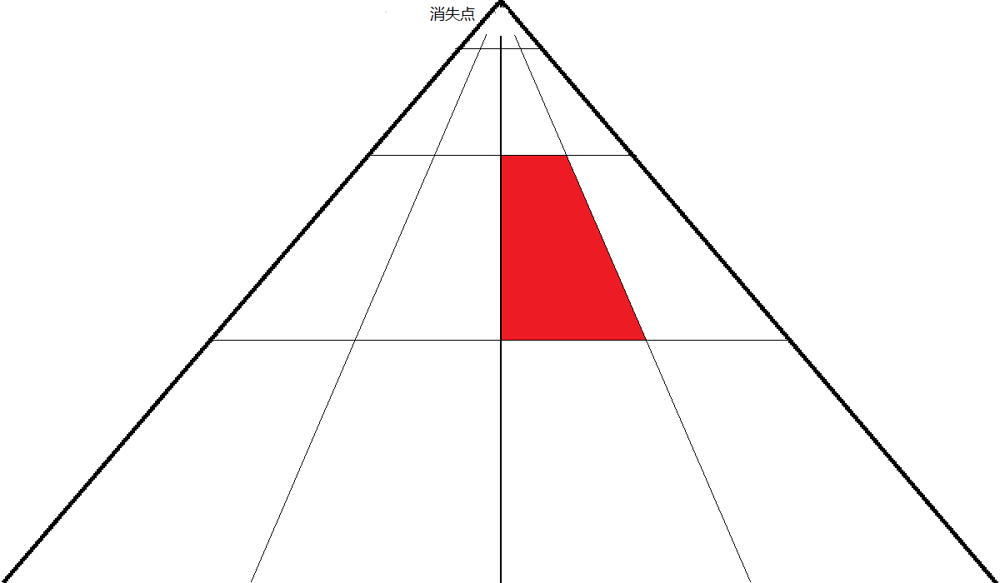
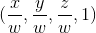
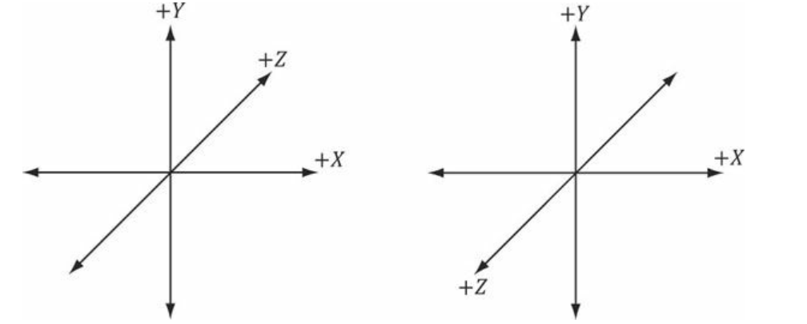
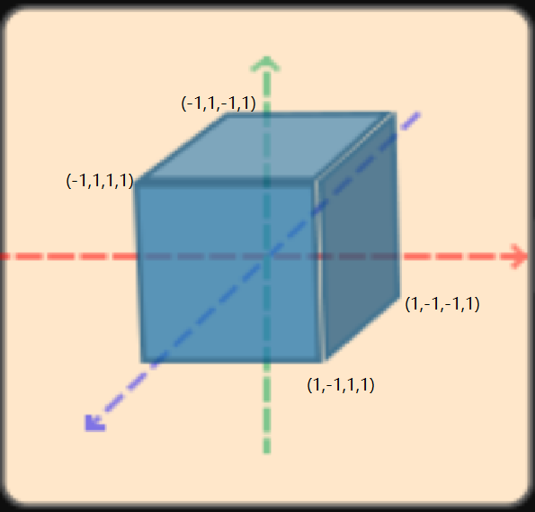

<link rel="stylesheet" href="https://cdn.jsdelivr.net/npm/katex@0.10.1/dist/katex.min.css">

# 计算机图形学&OpenGL系列教程（四） 坐标系与坐标变换

&emsp;&emsp;本次教程将围绕OpenGL中的坐标系和坐标变换，讲解有关的数学方面的内容，并完成所需的数学函数。本文的代码和数学原理都是课程期末考试的重点和难点，同学们一定要弄懂<del>请同学们找出大一上学期的线性代数课本以备不时之需</del>。

## 向量与矩阵

&emsp;&emsp;这里不再赘述向量与矩阵的基本概念与基本运算法则，以及线性空间的性质等内容，只讲OpenGL中的特殊性。OpenGL中常用四维坐标表示点和向量，若第四个分量w的值为1，则表示三维空间中的一个点，如果第四个分量值为0，则表示一个向量，w分量取值这样设计的好处在之后会体现出来。w的取值其实不限定于0和1，它在一次渲染过程中经过运算可能会变成其它的值并具有其它的用途，但牢记0和1这两个取值对我们OpenGL编程来说初步是足够了。OpenGL的向量是**列向量**，方便起见，在书写时就略去了转置符号T，即教程中书写向量(x, y, z, 1)它指代的是：



&emsp;&emsp;体现在代码上，我们这样定义点，向量：
```C++
using Point3 = float[3];    //相当于typedef float Point3[3]; 使用using关键字定义类型别名通常更加直观
using Vector3 = float[3];
using Point4 = float[4];
using Vector4 = float[4];
```

&emsp;&emsp;因为使用四维向量，所以进行相关运算(主要是基变换)的矩阵为四行四列的方阵。如果不特殊说明，本教程中术语**矩阵**也都特指四行四列的方阵。

&emsp;&emsp;OpenGL的矩阵是所谓的列优先矩阵，体现在编程中其实是，如果我们使用下面的变量m
```
Vector4 m[4]; 
```
去储存矩阵的元素，那么矩阵第i行第j列的元素储存在m\[j]\[i]，而非我们之前习惯的m\[i]\[j]。这虽然是一个小问题但是如果不注意很容易造成实际编程中出现错误。

&emsp;&emsp;于是我们定义出矩阵类Matrix4和相关的基本的运算：
```C++
class Matrix4 {
    float data[4][4];
public:
    Matrix4() {
        memset(data, 0, sizeof(data));
        makeUnit();
    }
    Matrix4(const Matrix4& m) {  //拷贝构造函数
        *this = m;
    }
    Matrix4(const std::initializer_list<Vector4> &vs) {
        assert(vs.end() - vs.begin() == 4);
        for (int i = 0; i < 4; i++) for (int j = 0; j < 4; j++) {  //因为OpenGL矩阵是列优先矩阵，这里将输入的数据转置储存
            data[i][j] = (*(vs.begin() + j))[i];
        }
    }
    //索引。注意OpenGL矩阵的第i行第j列元素存放在data[j][i]
    float& operator()(int i, int j) { return data[j][i]; }
    const float& operator()(int i, int j) const { return data[j][i]; }
    using float4 = Vector4;
    //下面两个成员函数在对象被强制转换为float4时调用
    operator float4* () const { return const_cast<float4*>(data); }
    operator float4* () { return data; }
    //下面两个成员函数在对象被强制转换为void*时调用
    operator void* () const { return const_cast<float4*>(data); }
    operator void* () { return data; }
    Matrix4& operator=(const Matrix4& m) {
        memcpy(data, (float4*)m, sizeof(data));
        return *this;
    }
    Matrix4& multiple(const Matrix4& m) {
        float4 tmp[4];
        for (int i = 0; i < 4; i++) {
            for (int j = 0; j < 4; j++) {
                tmp[j][i] = 0.0;  //注意i,j反过来
                for (int k = 0; k < 4; k++) {
                    tmp[j][i] += (*this)(i, k) * m(k, j);
                }
            }
        }
        memcpy(data, tmp, sizeof(data));
        return *this;
    }
    //单位阵
    Matrix4& makeUnit() {
        data[0][0] = data[1][1] = data[2][2] = data[3][3] = 1.0;
        return *this;
    }
};
```

## 坐标与坐标变换

&emsp;&emsp;计算机图形学要解决的一个基本问题便是如何将三维空间物体呈现在计算机的显示器上。同时方法还要足够方便，灵活，能够充分利用计算机强大的数字计算能力。将三维物体呈现在二维介质上的问题，从很久之前就被研究了，数百年前(也许是上千年前?)画家们就已经有了成熟的技术使得一副图像看起来有较强立体感。想象你站在一条笔直向前的街道上，向前方望去，你会发现，越向远方看去，本是平行的街道两边，竟然
会挨得越来越近，最终消失在同一点。因此画家们定义出了“消失点(Vanish point)”：



那么上图中本来是矩形的红色砖块，就会变形称为梯形，而且水平方向本应同等长度的平行线，却有着“近大远小”的特点。依照在朝向远处的消失点的一对平行线延长将会相交于消失点，以及“近大远小”规律，就可以以此在2维平面上做出有立体感的矩形，立方体等。上面提到的只是所谓的“一点透视”，更加复杂一些的本教程不再讲述，<del>有兴趣同学假期宅着太闲的话可以去学画画。</del>除此之外，光照，图形表面的细节也有助于提高其立体感，这在之后的教程中会提到。

&emsp;&emsp;计算机图形学为了在计算机上完成这个任务，借助线性代数中基变换和坐标变换的方式，完成三维图形的点坐标到屏幕上二维坐标的变换。相关线性代数内容可以参阅<a href="https://wenku.baidu.com/view/fe772ad2195f312b3169a575.html">百度文库</a><del>或者拿出大一上学期线性代数课本好吧我知道你扔了。</del>

&emsp;&emsp;在OpenGL中，主要包括这样五个坐标系统(五组基)

&emsp;&emsp;<li>局部空间(Local Space) (也叫局部坐标，Local Coordinate，这里“空间”和“坐标”的说法经常交换使用，指的是同一个概念，之后不再重复) </li>
&emsp;&emsp;<li>世界空间(World Space) </li>
&emsp;&emsp;<li>观察空间(View Space) 也叫做摄像机空间(Camera Space) </li>
&emsp;&emsp;<li>裁剪空间(Clip Space) </li>
&emsp;&emsp;<li>屏幕空间(Screen Space) </li>

&emsp;&emsp;我们通常关注前4个空间之间的坐标变换，从局部空间到世界空间的坐标变换称作“W变换”，从世界空间到观察空间的变换称作“V变换”，从观察空间到裁剪空间的变换称为“P变换”(投影变换，Projection Transformation)。这也是我们编程时主要关注的地方，而裁剪空间之后的变换工作一般都主要由OpenGL完成。“W变换”，“V变换”，“P变换”合称“WVP变换”。完成WVP变换后。OpenGL进行所谓的“透视除法”，即对WVP变换后点变为。一般来说，无论初始的模型的局部坐标如何，“透视除法”之后，坐标x, y, z的取值会归一化到范围在\[-1. 1]之间的数，这个坐标也称作标准化设备坐标(NDC, Normalized Device Coordinate)，而“透视除法”后超出NDC坐标范围的点将被裁剪掉，然后再转换到屏幕上窗口中的坐标到屏幕空间(Screen Space)中，这时候的坐标取前两个分量(x,y)就已经是在屏幕上的窗口里面的位置了，然而z坐标并没有被丢弃，z坐标在深度测试和颜色合成时还有至关重要的用途，在下一章教程中会讲到。到这里三维的图形的坐标就变换到了二维的平面上了。其流程可以用下面的图片直观表示：


(<a href="https://blog.csdn.net/linuxheik/article/details/81747087">图片来源</a>，图中模型变换即W变换)

&emsp;&emsp;之后展开介绍各个空间和空间之间的坐标变换，并给出相关原理介绍和代码实现

### 首先说坐标系

&emsp;&emsp; 在进入屏幕空间之前，OpenGL和我们在线性代数课程中所学一样使用右手坐标系，即x轴正方向在纸面内水平向右，y轴正方向在纸面内竖直向上，z轴正方向垂直纸面向外。如下图的右边的坐标系所示:



&emsp;&emsp; 之后所讲的坐标变换方法在左手坐标系中也都成立，但要注意Z轴的方向相反。在自测题目中会有左手坐标系有关的题目。

### 局部空间

&emsp;&emsp; 局部空间即只包含所关注三维物体的空间，通常以该物体的几何中心或者某个顶点为原点。在这个坐标系下三维物体上的各个点的坐标就是局部坐标。例如一个棱长为2的正方体，局部空间坐标系原点位于其几何中心，那么它前面左上顶点的坐标就是(-1, 1, 1, 1)，这里刻意使用了四维坐标去表示：



&emsp;&emsp; 局部空间方便我们能够关注三维物体本身，无论三维物体怎样放置，物体上各个点在局部空间的坐标始终保持不变。使用计算机三维设计软件例如3DMax等设计出的模型，模型上各点的坐标也都是模型局部空间内的局部坐标。

### 世界空间

### 观察空间

### 裁剪空间

### 屏幕空间

### W变换

#### 缩放(S变换)

#### 旋转(R变换)

#### 平移(T变换)

### V变换

### P变换

#### 正交投影

#### 透视投影

## 参考资料

