# 计算机图形学&OpenGL系列教程（四） 坐标系与坐标变换

&emsp;&emsp;本次教程将围绕OpenGL中的坐标系和坐标变换，讲解有关的数学方面的内容，并完成所需的数学函数。本文的代码和数学原理都是课程期末考试的重点和难点，同学们一定要弄懂<del>请同学们找出大一上学期的线性代数课本以备不时之需</del>。

## 向量与矩阵

&emsp;&emsp;这里不再赘述向量与矩阵的基本概念与基本运算法则，以及线性空间的性质等内容，只讲OpenGL中的特殊性。OpenGL中常用四维坐标表示点和向量，若第四个分量w的值为1，则表示三维空间中的一个点，如果第四个分量值为0，则表示一个向量，w分量取值这样设计的好处在之后会体现出来。w的取值其实不限定于0和1，它在一次渲染过程中经过运算可能会变成其它的值并具有其它的用途，但牢记0和1这两个取值对我们OpenGL编程来说初步是足够了。OpenGL的向量是**列向量**，方便起见，在书写时就略去了转置符号T，即教程中书写向量(x, y, z, 1)它指代的是：


&emsp;&emsp;体现在代码上，我们这样定义点，向量：
```C++
using Point3 = float[3];    //相当于typedef float Point3[3]; 使用using关键字定义类型别名通常更加直观
using Vector3 = float[3];
using Point4 = float[4];
using Vector4 = float[4];
```

&emsp;&emsp;因为使用四维向量，所以进行相关运算(主要是基变换)的矩阵为四行四列的方阵。如果不特殊说明，本教程中术语**矩阵**也都特指四行四列的方阵。

&emsp;&emsp;OpenGL的矩阵是所谓的列优先矩阵，体现在编程中其实是，如果我们使用下面的变量m
```
Vector4 m[4]; 
```
去储存矩阵的元素，那么矩阵第i行第j列的元素储存在m\[j]\[i]，而非我们之前习惯的m\[i]\[j]。这虽然是一个小问题但是如果不注意很容易造成实际编程中出现错误。

&emsp;&emsp;于是我们定义出矩阵类Matrix4和相关的基本的运算：
```C++
class Matrix4 {
    float data[4][4];
public:
    Matrix4() {
        memset(data, 0, sizeof(data));
        makeUnit();
    }
    Matrix4(const Matrix4& m) {  //拷贝构造函数
        *this = m;
    }
    Matrix4(const std::initializer_list<Vector4> &vs) {
        assert(vs.end() - vs.begin() == 4);
        for (int i = 0; i < 4; i++) for (int j = 0; j < 4; j++) {  //因为OpenGL矩阵是列优先矩阵，这里将输入的数据转置储存
            data[i][j] = (*(vs.begin() + j))[i];
        }
    }
    //索引。注意OpenGL矩阵的第i行第j列元素存放在data[j][i]
    float& operator()(int i, int j) { return data[j][i]; }
    const float& operator()(int i, int j) const { return data[j][i]; }
    using float4 = Vector4;
    //下面两个成员函数在对象被强制转换为float4时调用
    operator float4* () const { return const_cast<float4*>(data); }
    operator float4* () { return data; }
    //下面两个成员函数在对象被强制转换为void*时调用
    operator void* () const { return const_cast<float4*>(data); }
    operator void* () { return data; }
    Matrix4& operator=(const Matrix4& m) {
        memcpy(data, (float4*)m, sizeof(data));
        return *this;
    }
    Matrix4& multiple(const Matrix4& m) {
        float4 tmp[4];
        for (int i = 0; i < 4; i++) {
            for (int j = 0; j < 4; j++) {
                tmp[j][i] = 0.0;  //注意i,j反过来
                for (int k = 0; k < 4; k++) {
                    tmp[j][i] += (*this)(i, k) * m(k, j);
                }
            }
        }
        memcpy(data, tmp, sizeof(data));
        return *this;
    }
    //单位阵
    Matrix4& makeUnit() {
        data[0][0] = data[1][1] = data[2][2] = data[3][3] = 1.0;
        return *this;
    }
    //向量点乘
    template<int N, class vectorType = float[N]>
    static float dot(const vectorType &v1, const vectorType &v2) {
        float res = 0.0;
        for (int i = 0; i < N; i++)
            res += v1[i] * v2[i];
        return res;
    }
    //向量-
    template<int N, class vectorType = float[N]>
    static void sub(const vectorType& v1, const vectorType& v2, vectorType& res) {
        for (int i = 0; i < N; i++)
            res[i] = v1[i] - v2[i];
    }
    //三维向量叉积
    static void cross(const Vector3& v1, const Vector3& v2, Vector3 &res) {
        res[0] = v1[1] * v2[2] - v1[2] * v2[1];
        res[1] = v1[2] * v2[0] - v1[0] * v2[2];
        res[2] = v1[0] * v2[1] - v1[1] * v2[0];
    }
    //向量长度
    template<int N, class vectorType = float[N]>
    static inline float length(const vectorType &vec) {
        float sum = 0.0;
        for (int i = 0; i < N; i++)
            sum += vec[i] * vec[i];
        return sqrtf(sum);
    }
    //向量归一化(取单位向量)
    template<int N, class vectorType = float[N]>
    static void normalize(vectorType& vec) {
        float len = length<N>(vec);
        if (len < 1e-8)  //consider as a zero vector 
            return;
        for (int i = 0; i < N; i++)
            vec[i] /= len;
    }
};
```

## 坐标与坐标变换

&emsp;&emsp;计算机图形学要解决的一个基本问题便是如何将三维空间物体呈现在计算机的显示器上。同时方法还要足够方便，灵活，能够充分利用计算机强大的数字计算能力。将三维物体呈现在二维介质上的问题，从很久之前就被研究了，数百年前(也许是上千年前?)画家们就已经有了成熟的技术使得一副图像看起来有较强立体感。想象你站在一条笔直向前的街道上，向前方望去，你会发现，越向远方看去，本是平行的街道两边，竟然
会挨得越来越近，最终消失在同一点。因此画家们定义出了“消失点(Vanish point)”：


那么上图中本来是矩形的红色砖块，就会变形称为梯形，而且水平方向本应同等长度的平行线，却有着“近大远小”的特点。依照在朝向远处的消失点的一对平行线延长将会相交于消失点，以及“近大远小”规律，就可以以此在2维平面上做出有立体感的矩形，立方体等。上面提到的只是所谓的“一点透视”，更加复杂一些的本教程不再讲述，<del>有兴趣同学假期宅着太闲的话可以去学画画。</del>除此之外，光照，图形表面的细节也有助于提高其立体感，这在之后的教程中会提到。

&emsp;&emsp;计算机图形学为了在计算机上完成这个任务，借助线性代数中基变换和坐标变换的方式，完成三维图形的点坐标到屏幕上二维坐标的变换。相关线性代数内容可以参阅<a href="https://wenku.baidu.com/view/fe772ad2195f312b3169a575.html">百度文库</a><del>或者拿出大一上学期线性代数课本好吧我知道你扔了。</del>

&emsp;&emsp;在OpenGL中，主要包括这样五个坐标系统(五组基)

&emsp;&emsp;<li>局部空间(Local Space) (也叫局部坐标，Local Coordinate，这里“空间”和“坐标”的说法经常交换使用，指的是同一个概念，之后不再重复) </li>
&emsp;&emsp;<li>世界空间(World Space) </li>
&emsp;&emsp;<li>观察空间(View Space) 也叫做摄像机空间(Camera Space) </li>
&emsp;&emsp;<li>裁剪空间(Clip Space) </li>
&emsp;&emsp;<li>屏幕空间(Screen Space) </li>

&emsp;&emsp;我们通常关注前4个空间之间的坐标变换，从局部空间到世界空间的坐标变换称作“W变换”，从世界空间到观察空间的变换称作“V变换”，从观察空间到裁剪空间的变换称为“P变换”(投影变换，Projection Transformation)。这也是我们编程时主要关注的地方，而裁剪空间之后的变换工作一般都主要由OpenGL完成。“W变换”，“V变换”，“P变换”合称“WVP变换”。完成WVP变换后。OpenGL进行所谓的“透视除法”，即对WVP变换后点变为。一般来说，无论初始的模型的局部坐标如何，“透视除法”之后，坐标x, y, z的取值会归一化到范围在\[-1. 1]之间的数，这个坐标也称作标准化设备坐标(NDC, Normalized Device Coordinate)，而“透视除法”后超出NDC坐标范围的点将被裁剪掉，然后再转换到屏幕上窗口中的坐标到屏幕空间(Screen Space)中，这时候的坐标取前两个分量(x,y)就已经是在屏幕上的窗口里面的位置了，然而z坐标并没有被丢弃，z坐标在深度测试和颜色合成时还有至关重要的用途，在下一章教程中会讲到。到这里三维的图形的坐标就变换到了二维的平面上了。其流程可以用下面的图片直观表示：


(<a href="https://blog.csdn.net/linuxheik/article/details/81747087">图片来源</a>，图中模型变换即W变换)

&emsp;&emsp;之后展开介绍各个空间和空间之间的坐标变换，并给出相关原理介绍和代码实现

### 首先说坐标系

&emsp;&emsp; 在进入所谓的NDC空间之前，OpenGL和我们在线性代数课程中所学一样使用右手坐标系，即x轴正方向在纸面内水平向右，y轴正方向在纸面内竖直向上，z轴正方向垂直纸面向外。如下图的右边的坐标系所示。而下图中左边的是左手坐标系。


(图片来自书籍 Introduction to 3D Game Programming with Directx 11的"向量代数"章节Figure1.5)

&emsp;&emsp; 之后所讲的坐标变换方法主要是在右手坐标系中进行的，但是在左手坐标系中也都成立，要注意Z轴的方向相反。在自测题目中会有左手坐标系有关的题目。

### 局部空间

&emsp;&emsp; 局部空间即只包含所关注三维物体的空间，通常以该物体的几何中心或者某个顶点为原点。在这个坐标系下三维物体上的各个点的坐标就是局部坐标。例如一个棱长为2的正方体，局部空间坐标系原点位于其几何中心，那么它前面左上顶点的坐标就是(-1, 1, 1, 1)，这里刻意使用了四维坐标去表示：


(<a href="learnopengl-cn.github.io">图片来源</a>)

&emsp;&emsp; 局部空间方便我们能够关注三维物体本身，无论三维物体怎样放置，物体上各个点在局部空间的坐标始终保持不变。使用计算机三维设计软件例如3DMax等设计出的模型，模型上各点的坐标也都是模型局部空间内的局部坐标。

### 世界空间

&emsp;&emsp; 如果我们想把一堆模型加载到我们的画面上，如果只有物体的局部坐标，那么他们大概会堆积在一起。我们想把它们排布在我们想放置的位置上，就需要把模型上各个顶点的局部坐标变换到所谓的世界坐标中，世界坐标正如你所想，是指点相对于全局世界的位置坐标。这个坐标变换正是W变换。

### 观察空间

&emsp;&emsp; 量子力学的观察者效应说，一个意识体的观察会对物质世界的状态产生重大影响，在计算机图形的世界中尤其如此，在图形的世界中存在一个假想的“摄像机”(Camera)，摄像机观测到的图形的空间位置才是物体最终呈现出来的空间位置。因此我们需要一个从物体的世界坐标到摄像机的观察坐标的一个变换，这正是V变换。

### 裁剪空间

&emsp;&emsp; 完成前面的W变换和V变换后，我们希望把模型各点的坐标再变换到一个空间，这个空间模型各个点的坐标都在一个可以确定的范围内，这个就是裁剪空间。一方面便于裁减掉“出界”的部分，另一方面坐标范围确定便于之后转换到屏幕坐标。从观察空间到裁剪空间的变换就是P变换（投影变换），投影又主要包括两种，一种是正交投影，另一种是透视投影。正交投影的结果类似于三视图，忠实地反应了可见的各部分的实际长度，而另一种游戏编程中主要用到的透视投影的结果，就是仿照人眼观察空间得到的图形，有着近大远小导致变形等特点。

### NDC空间

&emsp;&emsp; 完成P变换后，物体各个点坐标(x, y, z, w)都除以w分量，变为(x', y', z', 1)，且满足各个x,y,z各个分量都在\[-1, 1]之间（这个所谓的“透视除法”是OpenGL自动完成的，不需要编程中刻意去做，为什么满足这个坐标范围之后投影变换部分会讲）。NDC空间使用的是**左手坐标系**(我也不知道为什么突然改用左手坐标系了，这个后面投影的时候有用，先记住)，空间内的坐标与最终呈现图像的设备的尺寸，宽高比等都无关，使的图形能摆脱对支撑软件、具体物理设备的依赖性，也方便能在不同应用和不同系统之间交换图形信息。 一个初学者常有的误区是，坐标永远都应该在\[-1, 1]之间，其实不是，只是到NDC空间之后才是这样，在之前的局部坐标，世界坐标，观察坐标中，坐标取值都没有这个限制的，而是直到投影变换才将坐标变换到一个能确定的但是与参数有关的范围，再进一步完成透视除法后才到NDC坐标有\[-1, 1]的与参数无关的范围。

### 屏幕空间

&emsp;&emsp;最后图形要呈现在屏幕上，成为图像，坐标就从NDC空间变换到屏幕空间上。屏幕空间即是指屏幕上窗口中显示最终渲染所得图像的空间，它的坐标系统与第二章的图像的坐标系统一致，都以左上角为原点(0, 0)，水平向右为x正方向，竖直向下为y正方向。使用一个**glViewport**函数就可以指示屏幕空间在窗口的位置和大小。

### W变换

&emsp;&emsp;W变换是从局部坐标到世界坐标的变换，W变换由包括缩放(Scale)，旋转(Rotate)，平移(Translate)三部分，一般按照先缩放，再旋转，最后平移的原则进行。

#### 缩放(S变换)

&emsp;&emsp;缩放变换很简单，由于物体最开始就是位于原点的，我们直接将各个点坐标(x, y, z, 1)的前三个分量乘上各自方向上的缩放系数即可。为了方便常用基变换矩阵去实现，容易验证，公式如下：

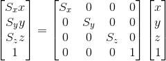

对应Matrix4类中的代码如下：
```C++
  //伸缩变换，sx是x方向的缩放系数，sy, sz同理
    Matrix4& scale(float sx, float sy, float sz) {
        Matrix4 m;      //这里依照公式构造基变换矩阵m
        m(0, 0) = sx;
        m(1, 1) = sy;
        m(2, 2) = sz;
        multiple(m);    //将m表示的变换累加到this
        return *this;
    }
```

#### 旋转(R变换) 

(由于github Readme不支持latex，下文部分内容包含数学公式过多，因此使用Latex排版后截图放在这里，手机上可能观看不方便)


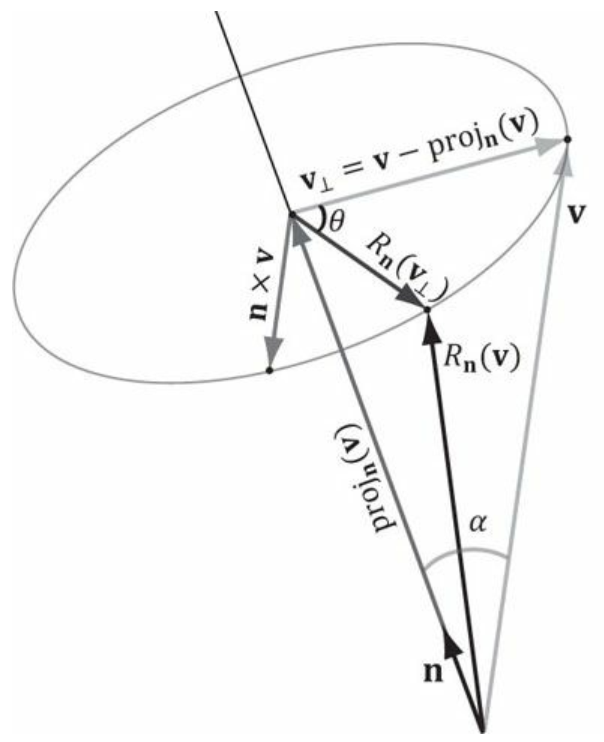
(上图来自Introduction to 3D Game Programming with Directx 11的Figure3.3)

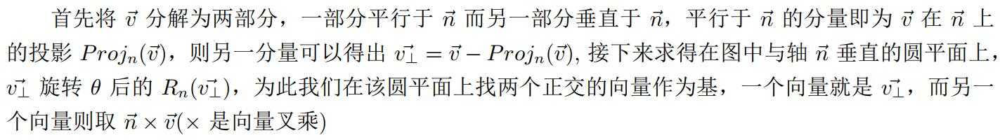

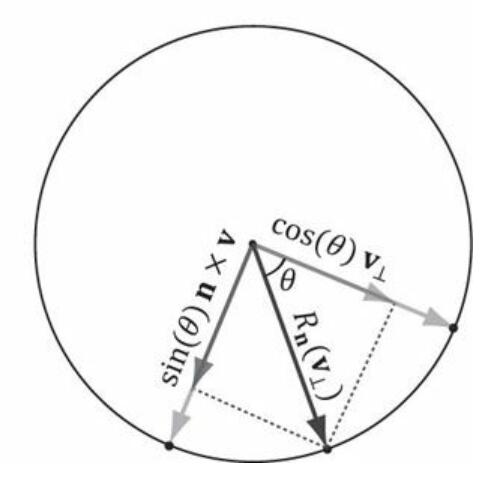

(上图来自Introduction to 3D Game Programming with Directx 11的Figure3.3)

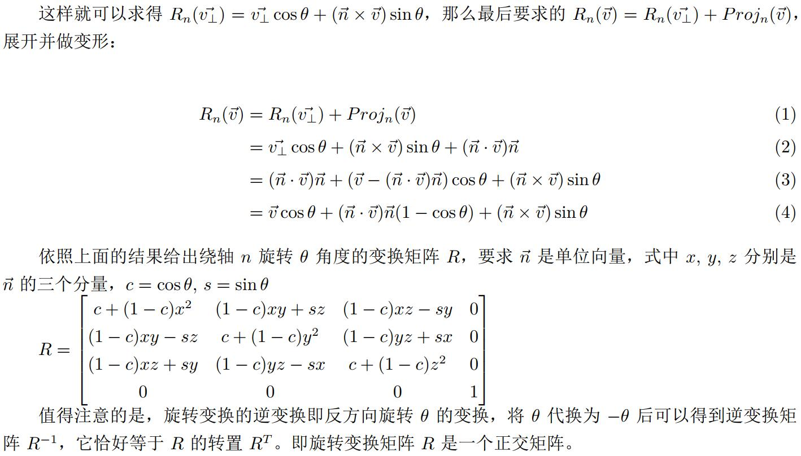

于是可以写出作用旋转变换的代码：

```C++
    Matrix4& rotate(const Vector3& axis, float angle) {
        float c = cosf(angle), s = sinf(angle);
        Vector3 N;
        memcpy(N, axis, sizeof(N));
        normalize<3>(N);
        float xy = N[0] * N[1];
        float xz = N[0] * N[2];
        float yz = N[1] * N[2];
        Matrix4 trans({
            {c+(1-c)*N[0]*N[0], (1-c)*xy+s*N[2], (1-c)*xz-s*N[1], 0},
            {(1-c)*xy-s*N[2], c+(1-c)*N[1]*N[1], (1-c)*yz+s*N[0], 0},
            {(1-c)*xz+s*N[1], (1-c)*yz-s*N[0], c+(1-c)*N[2]*N[2], 0},
            {              0,               0,                 0, 1}
        });
        multiple(trans);
        return *this;
    }
```

#### 平移(T变换)

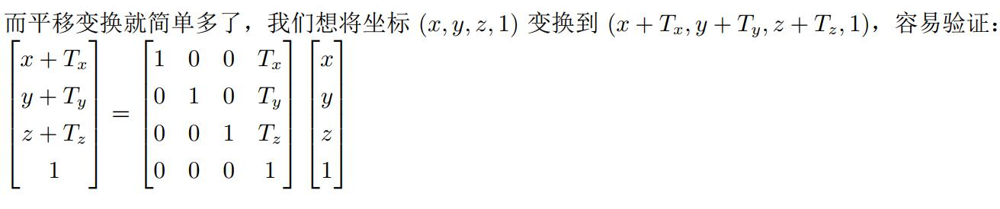

代码：

```C++
    //平移变换
    Matrix4& translate(float tx, float ty, float tz) {
        Matrix4 m;
        m(0, 3) = tx;
        m(1, 3) = ty;
        m(2, 3) = tz;
        multiple(m);
        return *this;
    }
```

### V变换

&emsp; &emsp; 首先给出View Space的坐标系统示意：

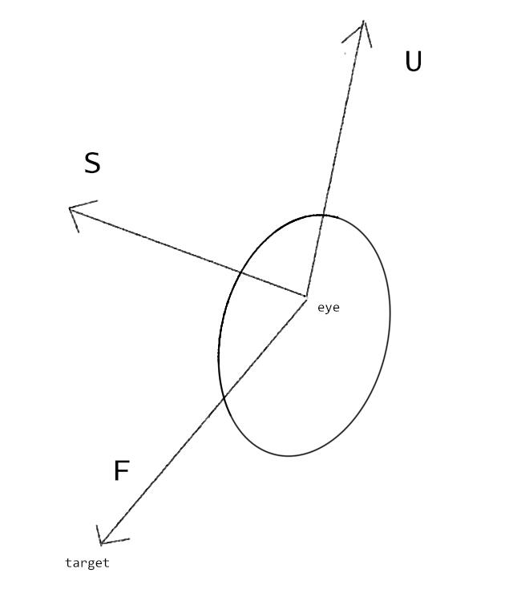

&emsp; &emsp;图中的圆（为了使得看起来有立体感进行了变形）是摄像机的镜头，或者眼睛的位置，正前方看向目标target。

&emsp; &emsp; 我们先进行一个位移变换，设摄像机的位置在(Ex, Ey, Ez)，那么空间中任意一点(x, y, z)，应该对摄像机具有一个相对的坐标(x - Ex, y - Ey, z - Ez)，因此变换矩阵为：

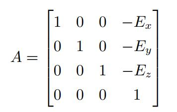

&emsp; &emsp; 然后进行摄像机视角的变换，用target的位置减去eye的位置可以得到一个向量F，还需要两个与之正交的向量可以构成三维空间内的一组基。我们需要知道指向眼睛上方的一个方向向量D(不一定是正上方)，又F叉乘D可以得到眼睛的正右方向S(用右手定则判定叉乘结果向量方向)，再又S和F叉乘得到眼睛的正上方方向向量U。这样F,S,U三个线性无关且相互正交的向量构成三维空间内的一组基，F,S,U都单位化后可以构造基变换过渡矩阵A（单位化是为了保证图形不变形，注意Z方向的问题，因为右手坐标系Z轴正方向垂直纸面向外，导致我们观察物体的时候总是朝向Z轴负方向看的，因此下面的式子中对此有修正）。

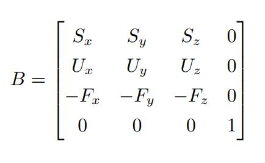

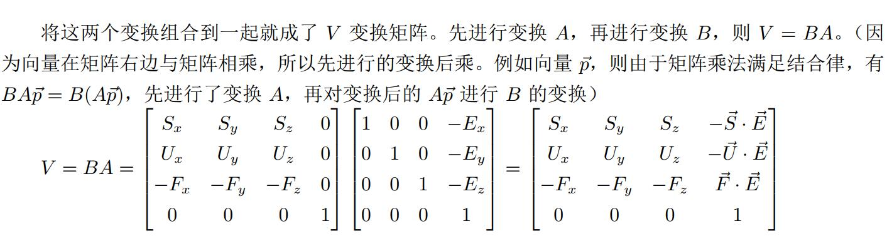

&emsp; &emsp; 代码如下：

```C++
    //函数接受三个参数，eyePosition给出眼睛的空间坐标
    //                 targetPosition给出眼睛看向的目标的空间坐标
    //                 upDirection给出指向眼睛上方的方向向量
    Matrix4& view(const Point3& eyePosition, const Point3& targetPosition, const Vector3& upDirection) {
        Vector3 F, S, U;
        sub<3>(targetPosition, eyePosition, F);
        normalize<3>(F);
        cross(F, upDirection, S);
        normalize<3>(S);
        cross(S, F, U);
        Matrix4 trans({
            {S[0], S[1], S[2],   -dot<3>(S, eyePosition)},
            {U[0], U[1], U[2],   -dot<3>(U, eyePosition)},
            {-F[0], -F[1], -F[2], dot<3>(F, eyePosition)},
            {0, 0, 0, 1}
        });
        multiple(trans);
        return *this;
    }
```

### P变换

#### 正交投影

&emsp;&emsp;

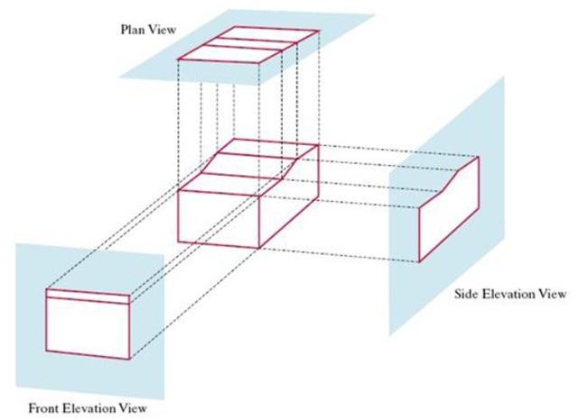 
<a href="https://blog.csdn.net/sy95122/article/details/81198268">图片来源</a>

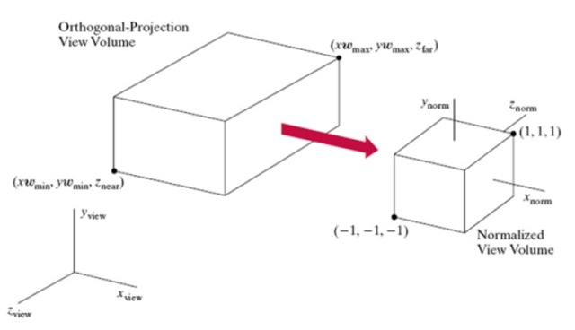
<a href="https://blog.csdn.net/sy95122/article/details/81198268">图片来源</a>

&emsp;&emsp;正交投影相当于是把长方体世界空间“压缩”到一个正六面体空间中，如上图（注意第二幅图，到NDC空间后变成了左手坐标系，Z轴正方形垂直纸面朝内）。相当于是缩放和平移变换的组合。这里直接给出正交投影矩阵：

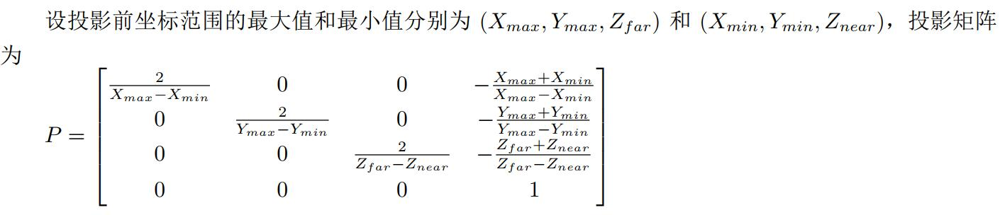

#### 透视投影

&emsp;&emsp;透视投影的原理就要复杂得多，它符合人眼观察物体的特点，透视投影是增强图形立体感的关健：

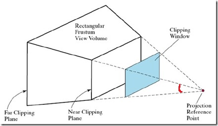
<a href="https://blog.csdn.net/sy95122/article/details/81198268">图片来源</a>，有修改

&emsp;&emsp;图中为从眼睛看到的空间，透视投影就是要将View Space下的坐标变换到上图中白色棱台内的空间中。该空间具有四个参数：**场视角**(FOV, Field of View，为图中红色标出的的角，用字母α表示)；**近平面Z坐标**(zNear，用字母n表示)，为棱台的形态学上顶面，同时限定了可见的点的最小Z坐标，**远平面Z坐标**(zFar，用字母f表示)，为棱台的形态学下底面，同时限定了可见的点的最大Z坐标；Z值超出zNear和zFar范围的最终点会被OpenGL裁剪掉。这也就是玩第一人称3D游戏时候，游戏里物体离你太远会看不到，而离得太近“贴在脸前”也会看不到的原因。最后还有一个参数为**窗口的宽高比**(Aspect Ratio，用字母r表示)，也就是上图中的Clip Window的宽高比，这个参数一般就等于glViewport指定的宽度和高度的比值。相当于透过Clip Window这个视窗去观察后面的物体。Clip Window也叫Projection Window。

&emsp;&emsp;我们还是要明确一件事情，由于完成V变换后的空间仍然使用的是右手坐标系，即我们从Projection Window向“深处”观察，越深处的Z坐标数值越小，这里给出透视投影空间的侧视图和俯视图：

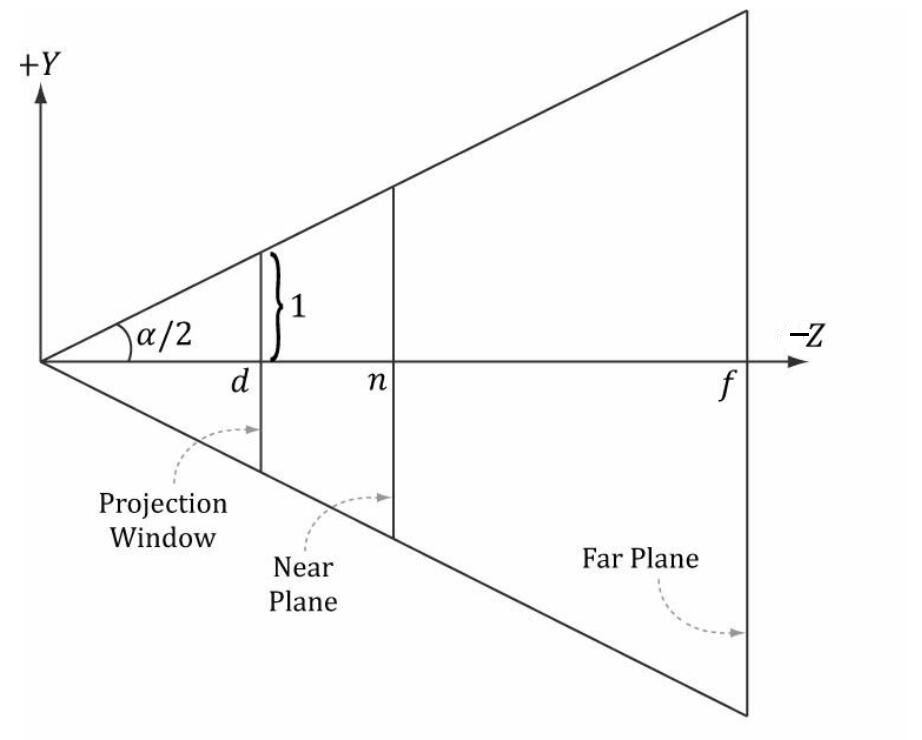
(透视投影空间侧视图，图来自Introduction to 3D Game Programming with Directx 11 Figure5.23，有修改，注意Z轴方向是-Z方向)


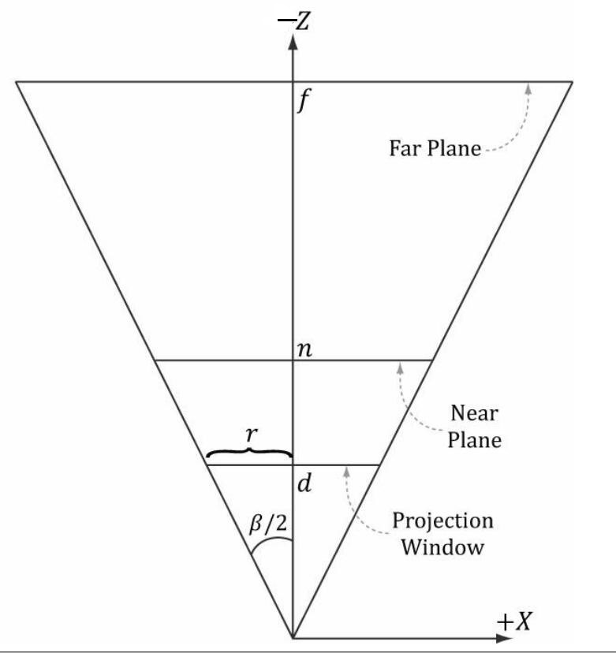
(投影空间俯视图，图来自Introduction to 3D Game Programming with Directx 11 Figure5.23，有修改注意Z轴方向是-Z方向)

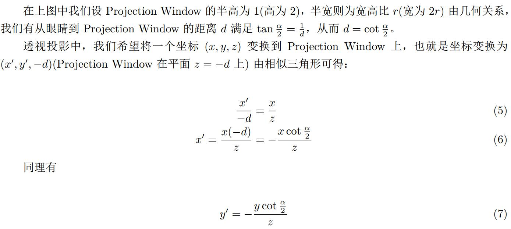

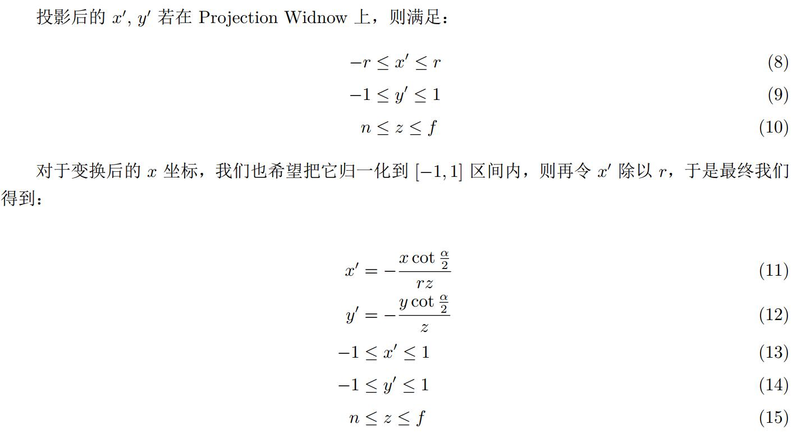

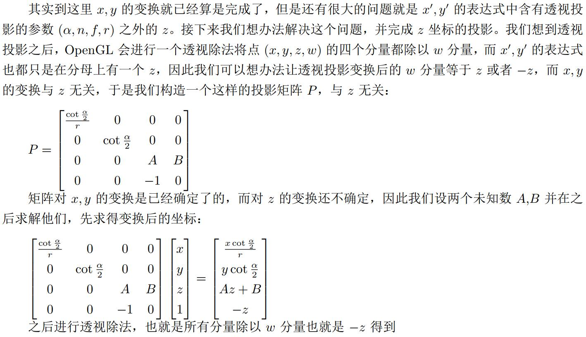

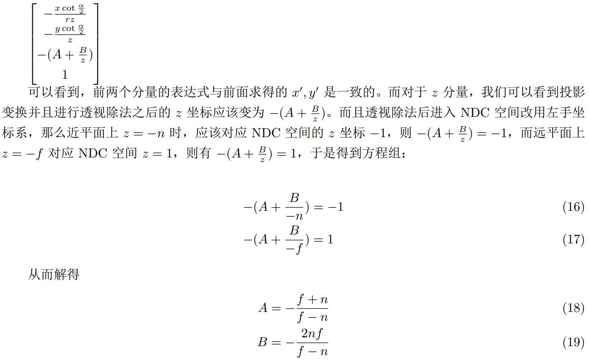

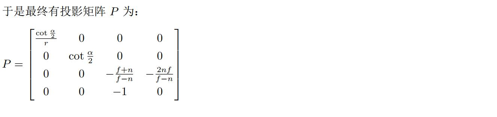

透视投影代码如下：

```C++
  //透视投影
    Matrix4& perspective(float fovyAngle, float aspectRatio, float zNear, float zFar) {
        assert(aspectRatio > 1e-8);
        float cot2 = 1.0f / tanf(fovyAngle / 2.0f);
        Matrix4 trans({
            {cot2 / aspectRatio, 0, 0, 0},
            {0, cot2, 0, 0},
            {0, 0, -(zFar + zNear) / (zFar - zNear), -(2 * zFar * zNear) / (zFar - zNear)},
            {0, 0, -1, 0}
        });
        multiple(trans);
        return *this;
    }
```

## 作者感言

## 自测题目&启示

## 参考资料

